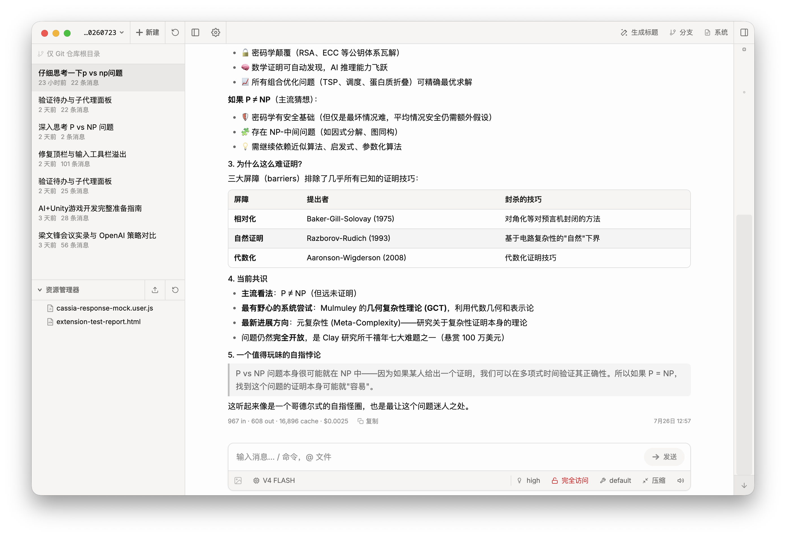
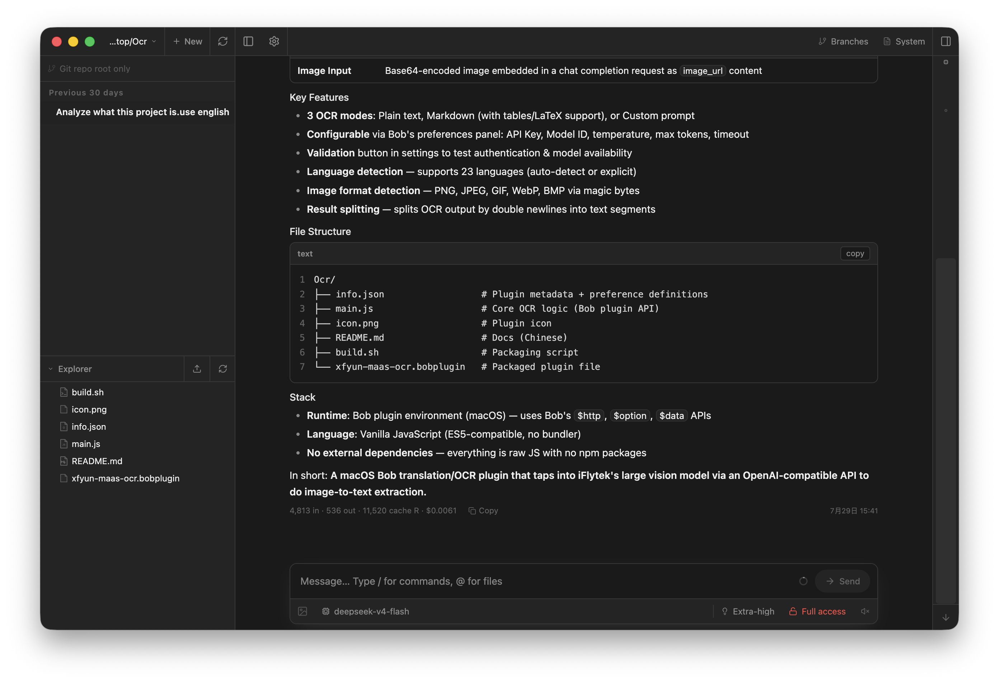
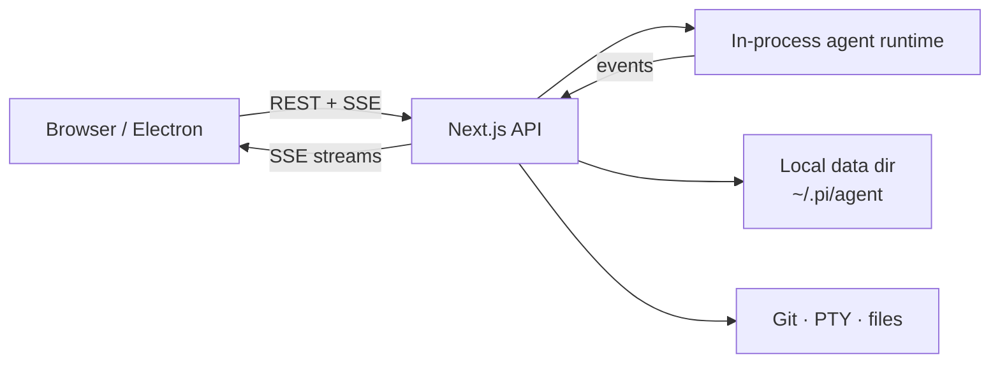

<div align="center">

# Pi Web

**Local agent workspace — chat, files, Git, and terminals in one app**

Web UI + Electron desktop · [ct-jyjntc/pi-web](https://github.com/ct-jyjntc/pi-web)

[](https://nodejs.org/)
[](./LICENSE)
[](#desktop)
[](https://github.com/ct-jyjntc/pi-web)

[中文](./README.zh-CN.md)
·
[Issues](https://github.com/ct-jyjntc/pi-web/issues)
·
[Releases](https://github.com/ct-jyjntc/pi-web/releases)

> Based on [agegr/pi-web](https://github.com/agegr/pi-web) — secondary development with additional features and modifications.

<br/>

<table>
  <tr>
    <td width="50%">
      
      <p align="center"><sub>Light</sub></p>
    </td>
    <td width="50%">
      
      <p align="center"><sub>Dark</sub></p>
    </td>
  </tr>
</table>

</div>

---

Pi Web is a **local-first coding-agent workspace** for your machine.  
Open a project, chat with the agent, review Git changes, browse files, and open terminals — in the browser or as a desktop app.

| | |
| :--- | :--- |
| Repository | [github.com/ct-jyjntc/pi-web](https://github.com/ct-jyjntc/pi-web) |
| Default URL | `http://127.0.0.1:30141` |
| Desktop port | `30142` (Electron) |
| Node | **≥ 22.19.0** |
| License | MIT |

## Highlights

- **Agent chat** — streaming replies, tool calls / results, thinking, context & cost, compaction
- **Session hub** — project-grouped history, rename / delete, auto title, fork & in-session branches
- **Git review** — status, stage / unstage, discard, commit, commit & push, pull, branch create, **AI commit messages**
- **Worktrees** — switch / create / remove Git worktrees from the sidebar ([guide](./docs/worktrees.md))
- **Terminals** — multi-tab PTY shells (xterm + node-pty) rooted at the project cwd
- **Files** — explorer, fuzzy index, preview for source / Markdown / images / audio / PDF / DOCX
- **Models & auth** — providers, OAuth / API keys, `models.json` editor, model smoke tests
- **Skills** — list, search, install, update, enable / disable
- **Permissions** — ask / full mode from the input bar
- **Settings** — theme, language, utility models (session title + commit message), update check
- **i18n & polish** — English / 中文, light / dark, chat minimap, shortcuts, completion sound
- **Desktop** — Electron shell with native window controls; macOS DMG & Windows NSIS builds

```text
┌────────────────┬─────────────────────┬──────────────────────┐
│  Projects &    │  Chat + tools       │  Review workspace    │
│  sessions      │  model · perms      │  Git · files · tty   │
└────────────────┴─────────────────────┴──────────────────────┘
```

## Run from source

> Node.js **22.19.0+** is required.

```bash
git clone https://github.com/ct-jyjntc/pi-web.git
cd pi-web
npm install
npm run dev          # http://127.0.0.1:30141
```

Production web server:

```bash
npm run build
npm run start        # http://127.0.0.1:30141
```

| Script | Bind |
| --- | --- |
| `npm run dev` / `start` | `127.0.0.1:30141` |
| `npm run dev:lan` / `start:lan` | `0.0.0.0:30141` (trusted network only) |

### CLI entry (after build)

```bash
node bin/pi-web.js
node bin/pi-web.js --port 8080
node bin/pi-web.js --hostname 0.0.0.0
node bin/pi-web.js --no-open
```

| Option / env | Meaning | Default |
| --- | --- | --- |
| `-p` / `--port` / `PORT` | HTTP port | `30141` |
| `-H` / `--hostname` / `PI_WEB_HOSTNAME` | Bind address | `127.0.0.1` |
| `--no-open` / `PI_WEB_NO_OPEN` | Skip opening browser | off |
| `PI_CODING_AGENT_DIR` | Local agent data directory | `~/.pi/agent` |

> [!WARNING]
> There is **no login**. Binding outside loopback exposes a high-privilege agent surface. Only do that on a network you trust.

### HTTP proxy

Server-side model traffic respects `HTTP_PROXY`, `HTTPS_PROXY`, `NO_PROXY`.

```bash
HTTP_PROXY=http://127.0.0.1:7890 \
HTTPS_PROXY=http://127.0.0.1:7890 \
NO_PROXY=localhost,127.0.0.1 \
npm run start
```

## Desktop

```bash
npm install
npm run electron:dev       # dev UI + Electron
npm run electron:prod      # production standalone + app
npm run dist:dmg           # macOS arm64 DMG
npm run dist:mac           # DMG + zip
npm run dist:win           # Windows NSIS
```

| Env | Purpose | Default |
| --- | --- | --- |
| `PI_WEB_ELECTRON_PORT` / `PI_WEB_PORT` | Local server port inside the app | `30142` |
| `PI_WEB_NODE_BINARY` | System Node for native modules | auto |

`npm run build:electron` builds Next standalone and bundles desktop runtime assets.

## How the app is wired



| Area | Implementation |
| --- | --- |
| Sessions | `app/api/sessions/*` · `lib/session-reader.ts` |
| Live agent | `app/api/agent/*` · `lib/rpc-manager.ts` |
| Git | `app/api/git/*` · `components/GitPanel.tsx` |
| Terminals | `app/api/cwd/pty/*` · `lib/pty-sessions.ts` · `TerminalPanel.tsx` |
| Files | `app/api/files/*` · `file-index` · `FileExplorer` / `FileViewer` |
| Models / auth | `app/api/models*` · `app/api/auth/*` · `ModelsConfig.tsx` |
| Skills | `app/api/skills/*` · `SkillsConfig.tsx` |
| Settings | `app/api/web-settings` · `SettingsPage.tsx` |
| Worktrees | `app/api/worktrees` · `lib/worktree.ts` |
| Updates | `app/api/app-update` |
| i18n | `lib/i18n/messages.ts` · `hooks/useLocale.ts` |

## Local data

| Path | Role |
| --- | --- |
| `~/.pi/agent` | Default data root (`PI_CODING_AGENT_DIR` overrides) |
| `…/sessions/…/*.jsonl` | Conversation history |
| `…/models.json` | Model / provider config (also edited in UI) |
| Built-in packages | Auto-installed on boot for web/desktop UX |

File browsing is scoped to session cwds, project roots, `~/pi-cwd-*`, and explicitly allowed roots.

## Development scripts

| Script | What it does |
| --- | --- |
| `npm run dev` / `dev:lan` | Next dev server |
| `npm run start` / `start:lan` | Production server |
| `npm run build` | Next production build |
| `npm run build:electron` | Web build + Electron standalone + runtime bundles |
| `npm run electron*` | Desktop workflows |
| `npm run dist:dmg` / `dist:mac` / `dist:win` | Installers |
| `npm run lint` | ESLint |
| `npm run verify` | Offline (+ optional HTTP) smoke checks |

```bash
npm run verify
VERIFY_HTTP=1 npm run verify   # when the server is already up
```

> [!CAUTION]
> Do **not** run `npm run build` while `npm run dev` is running. Both write `.next/` and will break each other.

<details>
<summary><b>Source layout</b></summary>

```text
app/api/           REST + SSE routes
components/        AppShell, chat, GitPanel, TerminalPanel, settings, …
hooks/             session SSE, locale, shortcuts, theme, audio
lib/               runtime, security, git, pty, i18n, session IO
electron/          desktop main + preload
bin/               CLI entry
scripts/           packaging, node-pty perms, verify
docs/              worktrees guide + screenshots
```

</details>

## Docs

- [Worktrees](./docs/worktrees.md)
- [中文 README](./README.zh-CN.md)

---

<div align="center">

**MIT** · [ct-jyjntc/pi-web](https://github.com/ct-jyjntc/pi-web)

</div>
