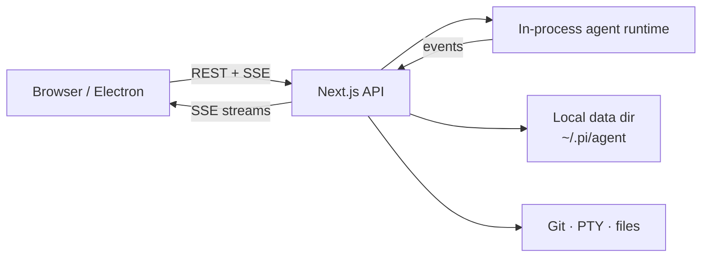

<div align="center">

# Pi Web

**Local agent workspace — chat, files, Git, and terminals in one app**

Web UI + Electron desktop · `@agegr/pi-web`

[](https://www.npmjs.com/package/@agegr/pi-web)
[](https://nodejs.org/)
[](./LICENSE)
[](#desktop)

[中文](./README.zh-CN.md)
·
[npm](https://www.npmjs.com/package/@agegr/pi-web)
·
[Issues](https://github.com/agegr/pi-web/issues)

<br/>

<table>
  <tr>
    <td width="50%">
      
      <p align="center"><sub>Light</sub></p>
    </td>
    <td width="50%">
      
      <p align="center"><sub>Dark</sub></p>
    </td>
  </tr>
</table>

</div>

---

Pi Web is a **local-first coding-agent workspace** you run on your machine.  
Open a project, talk to the agent, review Git changes, browse files, and open terminals — without juggling a pile of separate tools.

| | |
| :--- | :--- |
| Package | [`@agegr/pi-web`](https://www.npmjs.com/package/@agegr/pi-web) |
| CLI | `pi-web` |
| Default URL | `http://127.0.0.1:30141` |
| Desktop port | `30142` (Electron) |
| Node | **≥ 22.19.0** |
| License | MIT |

## Highlights

- **Agent chat** — streaming replies, tool calls / results, thinking, context & cost, compaction
- **Session hub** — project-grouped history, rename / delete / export HTML, auto title, fork & in-session branches
- **Git review** — status, stage / unstage, discard, commit, commit & push, pull, branch create, **AI commit messages**
- **Worktrees** — switch / create / remove Git worktrees from the sidebar ([guide](./docs/worktrees.md))
- **Terminals** — multi-tab PTY shells (xterm + node-pty) rooted at the project cwd
- **Files** — explorer, fuzzy index, preview for source / Markdown / images / audio / PDF / DOCX
- **Models & auth** — providers, OAuth / API keys, `models.json` editor, model smoke tests
- **Skills** — list, search, install, update, enable / disable
- **Permissions** — ask / full mode from the input bar
- **Settings** — theme, language, utility models (session title + commit message), in-app update check
- **i18n & polish** — English / 中文, light / dark, chat minimap, shortcuts, completion sound
- **Desktop** — Electron shell with native window controls; macOS DMG & Windows NSIS builds

```text
┌────────────────┬─────────────────────┬──────────────────────┐
│  Projects &    │  Chat + tools       │  Review workspace    │
│  sessions      │  model · perms      │  Git · files · tty   │
└────────────────┴─────────────────────┴──────────────────────┘
```

## Install & run

> Node.js **22.19.0+** is required (`package.json` → `engines`, enforced by the CLI).

### npx

```bash
npx @agegr/pi-web@latest
```

### Global CLI

```bash
npm install -g @agegr/pi-web
pi-web
```

Then open [http://127.0.0.1:30141](http://127.0.0.1:30141).  
The process binds **`127.0.0.1` by default** and can open the browser when Ready.

### CLI options

```bash
pi-web --port 8080
pi-web --hostname 0.0.0.0          # trusted network only
pi-web -p 8080 -H 0.0.0.0
pi-web --no-open

PORT=8080 pi-web
PI_WEB_HOSTNAME=0.0.0.0 pi-web
PI_WEB_NO_OPEN=1 pi-web
```

| Option / env | Meaning | Default |
| --- | --- | --- |
| `-p` / `--port` / `PORT` | HTTP port | `30141` |
| `-H` / `--hostname` / `PI_WEB_HOSTNAME` | Bind address | `127.0.0.1` |
| `--no-open` / `PI_WEB_NO_OPEN` | Skip opening browser | off |
| `PI_CODING_AGENT_DIR` | Local agent data directory | `~/.pi/agent` |

> [!WARNING]
> There is **no login**. Binding outside loopback exposes a high-privilege agent surface. Only do that on a network you trust. Non-loopback binds log a warning.

### HTTP proxy

Server-side model traffic respects `HTTP_PROXY`, `HTTPS_PROXY`, `NO_PROXY`.

```bash
HTTP_PROXY=http://127.0.0.1:7890 \
HTTPS_PROXY=http://127.0.0.1:7890 \
NO_PROXY=localhost,127.0.0.1 \
npx @agegr/pi-web@latest
```

## Desktop

```bash
npm install
npm run electron:dev       # dev UI + Electron
npm run electron:prod      # production standalone + app
npm run dist:dmg           # macOS arm64 DMG
npm run dist:mac           # DMG + zip
npm run dist:win           # Windows NSIS
```

| Env | Purpose | Default |
| --- | --- | --- |
| `PI_WEB_ELECTRON_PORT` / `PI_WEB_PORT` | Local server port inside the app | `30142` |
| `PI_WEB_NODE_BINARY` | System Node for native modules | auto |

Packaged builds bundle a Next standalone server, runtime Node helpers, and related tooling via `npm run build:electron`.

## How the app is wired



| Area | Implementation (this repo) |
| --- | --- |
| Sessions | `app/api/sessions/*` · `lib/session-reader.ts` |
| Live agent | `app/api/agent/*` · `lib/rpc-manager.ts` |
| Git | `app/api/git/*` · `components/GitPanel.tsx` |
| Terminals | `app/api/cwd/pty/*` · `lib/pty-sessions.ts` · `TerminalPanel.tsx` |
| Files | `app/api/files/*` · `file-index` · `FileExplorer` / `FileViewer` |
| Models / auth | `app/api/models*` · `app/api/auth/*` · `ModelsConfig.tsx` |
| Skills | `app/api/skills/*` · `SkillsConfig.tsx` |
| Settings | `app/api/web-settings` · `SettingsConfig.tsx` |
| Worktrees | `app/api/worktrees` · `lib/worktree.ts` |
| Updates | `app/api/app-update` (GitHub releases check) |
| i18n | `lib/i18n/messages.ts` · `hooks/useLocale.ts` |

## Local data

| Path | Role |
| --- | --- |
| `~/.pi/agent` | Default data root (`PI_CODING_AGENT_DIR` overrides) |
| `…/sessions/…/*.jsonl` | Conversation history |
| `…/models.json` | Model / provider config (also edited in UI) |
| Built-in packages | Auto-installed on boot for web/desktop UX (permissions, subagents, todo, ask-user, better-compaction) |

File browsing is scoped to session cwds, resolved project roots, `~/pi-cwd-*`, and explicitly allowed roots.

## Development

```bash
git clone https://github.com/agegr/pi-web.git
cd pi-web
npm install
npm run dev          # http://127.0.0.1:30141
```

| Script | What it does |
| --- | --- |
| `npm run dev` | Next dev on loopback `:30141` |
| `npm run dev:lan` | Next dev on `0.0.0.0:30141` |
| `npm run start` / `start:lan` | Production server |
| `npm run build` | Next production build |
| `npm run build:electron` | Web build + Electron standalone + runtime bundles |
| `npm run electron` / `electron:dev` / `electron:prod` | Desktop |
| `npm run dist:dmg` / `dist:mac` / `dist:win` | Installers |
| `npm run lint` | ESLint |
| `npm run verify` | Offline (+ optional HTTP) smoke checks |
| `npm run release` | Patch version · build · publish npm |

```bash
npm run verify
# optional live HTTP checks when the server is up:
VERIFY_HTTP=1 npm run verify
```

> [!CAUTION]
> Do **not** run `npm run build` while `npm run dev` is running. Both write `.next/` and will break each other. Build only for release or Electron packaging.

<details>
<summary><b>Source layout</b></summary>

```text
app/api/           REST + SSE routes (agent, git, pty, sessions, skills, …)
components/        AppShell, chat, GitPanel, TerminalPanel, settings, …
hooks/             session SSE, locale, shortcuts, theme, audio
lib/               runtime, security, git, pty, i18n, session IO
electron/          desktop main + preload
bin/               pi-web CLI
scripts/           packaging, node-pty perms, verify
docs/              worktrees guide + screenshots
```

</details>

## Docs

- [Worktrees](./docs/worktrees.md)
- [中文 README](./README.zh-CN.md)

---

<div align="center">

**MIT** © [agegr](https://github.com/agegr)

</div>
