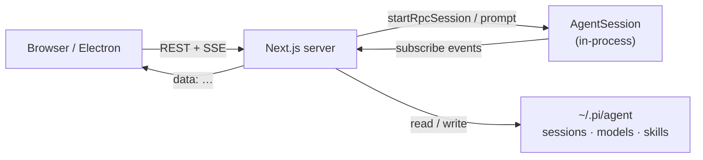

<div align="center">

# Pi Web

**Local web UI & desktop shell for the [pi coding agent](https://github.com/badlogic/pi-mono)**

[](https://www.npmjs.com/package/@agegr/pi-web)
[](https://nodejs.org/)
[](./LICENSE)
[](https://nextjs.org/)

[中文文档](./README.zh-CN.md) · [npm package](https://www.npmjs.com/package/@agegr/pi-web) · [Worktrees](./docs/worktrees.md) · [Issues](https://github.com/agegr/pi-web/issues)

<br/>

<table>
  <tr>
    <td width="50%">
      
      <p align="center"><sub>Light</sub></p>
    </td>
    <td width="50%">
      
      <p align="center"><sub>Dark</sub></p>
    </td>
  </tr>
</table>

</div>

---

Pi Web turns your local pi sessions into a full workspace: live chat, session tree, model & skill config, Git review, integrated terminals, and file preview — in the browser or as an Electron desktop app.

> [!NOTE]
> This repo is a **maintained fork** with desktop packaging, Git/terminal workspace panels, EN/中文 UI, and other UI-side enhancements on top of the upstream pi web experience.

## Table of Contents

- [Why Pi Web](#why-pi-web)
- [Quick Start](#quick-start)
- [CLI Options](#cli-options)
- [Desktop App](#desktop-app)
- [Features](#features)
- [How it fits together](#how-it-fits-together)
- [HTTP Proxy](#http-proxy)
- [Notes & paths](#notes--paths)
- [Development](#development)
- [Project structure](#project-structure)
- [License](#license)

## Why Pi Web

| | CLI alone | **Pi Web** |
| :--- | :--- | :--- |
| History | dig through terminal / session paths | browse by **project tree** |
| Streaming | TUI stream | structured Markdown, tool calls, minimap |
| Branching | manual | **fork** new sessions or switch **in-session** branches |
| Code | switch apps | Explorer + preview **beside** chat |
| Git | shell | **review panel** + worktree switcher |
| Terminal | separate window | multi-tab **project terminals** |
| Config | edit files | models, auth, skills, permissions in UI |

## Quick Start

> [!IMPORTANT]
> Requires **Node.js 20+** and a working [pi](https://github.com/badlogic/pi-mono) setup under `~/.pi/agent` (sessions, models, auth).

### One-liner

```bash
npx @agegr/pi-web@latest
```

### Global install

```bash
npm install -g @agegr/pi-web
pi-web
```

Then open **[http://127.0.0.1:30141](http://127.0.0.1:30141)** — the CLI auto-opens the browser when the server is ready. Pi Web listens on `127.0.0.1` by default.

## CLI Options

<details>
<summary><b>Ports, host binding, env vars</b></summary>

<br/>

```bash
pi-web --port 8080              # custom port
pi-web --hostname 0.0.0.0       # expose on a trusted network
pi-web -p 8080 -H 0.0.0.0       # combine options
pi-web --no-open                # do not open the browser

PORT=8080 pi-web                # env vars also work
PI_WEB_HOSTNAME=0.0.0.0 pi-web  # explicit network exposure
PI_WEB_NO_OPEN=1 pi-web         # background service / no auto-open
```

| Flag / Env | Meaning | Default |
| --- | --- | --- |
| `-p` / `--port` / `PORT` | Listen port | `30141` |
| `-H` / `--hostname` / `PI_WEB_HOSTNAME` | Bind address | `127.0.0.1` |
| `--no-open` / `PI_WEB_NO_OPEN=1` | Skip opening browser | open on Ready |
| `PI_CODING_AGENT_DIR` | Override pi agent dir | `~/.pi/agent` |

</details>

> [!WARNING]
> There is **no app-level login** and the agent is high-privilege. Do not expose Pi Web to the internet; only use non-loopback bindings on a trusted network. The Electron build binds loopback by default.

## Desktop App

Run Pi Web as a native shell (macOS DMG is the primary packaging path).

```bash
npm install
npm run electron:dev      # Next + Electron against local sources
npm run electron:prod     # production standalone → Electron
npm run dist:dmg          # package macOS arm64 DMG
```

<details>
<summary><b>Desktop environment variables</b></summary>

<br/>

| Variable | Purpose | Default |
| --- | --- | --- |
| `PI_WEB_ELECTRON_PORT` / `PI_WEB_PORT` | Preferred local port | `30142` |
| `PI_WEB_NODE_BINARY` | System Node for native modules (`node-pty`) | auto-detect |

</details>

## Features

```text
┌──────────────┬─────────────────────┬──────────────────────┐
│  Sessions    │  Live agent chat    │  Git + Terminals     │
│  by project  │  SSE · tools · cost │  review · multi-tab  │
├──────────────┼─────────────────────┼──────────────────────┤
│  Worktrees   │  Files & preview    │  Models · Skills     │
│  switch cwd  │  src · PDF · DOCX   │  OAuth · API keys    │
├──────────────┼─────────────────────┼──────────────────────┤
│  Fork /      │  Permissions        │  EN 中 · themes      │
│  branches    │  ask · full/YOLO    │  minimap · sound     │
└──────────────┴─────────────────────┴──────────────────────┘
```

- **Session workspace** — rename, delete, export HTML; pick work back up without hunting paths
- **Live agent chat** — SSE stream, tool calls/results, thinking, compaction, context usage
- **Safe branching** — fork into a new `.jsonl`, or continue / navigate in-session branches
- **Git worktrees** — sidebar switcher keeps sessions grouped; see [Worktrees](./docs/worktrees.md)
- **Git review** — status, diffs, jump-to-file next to the conversation
- **Integrated terminals** — multiple project-cwd terminals (xterm + node-pty)
- **File explorer & preview** — source, Markdown, images, audio, PDF, DOCX
- **Models & auth** — edit `models.json`, OAuth / API keys, smoke-test models
- **Skills** — list, search, install, toggle the same way the runtime loads them
- **Permission modes** — ask / full from the input bar
- **EN / 中文** — in-app locale toggle with persistent preference
- **Polish** — light/dark themes, chat minimap, completion sound, shortcuts (<kbd>Esc</kbd> abort)

## How it fits together



| Surface | Behavior |
| --- | --- |
| Session list / history | reads `.jsonl` via `SessionManager` helpers — **no** live agent |
| Send a message | `startRpcSession()` creates an in-process `AgentSession` |
| Live updates | `GET /api/agent/[id]/events` SSE stream |
| Running badges | `/api/agent/running/events` for sidebar status |

## HTTP Proxy

Server-side model and API traffic honors `HTTP_PROXY`, `HTTPS_PROXY`, and `NO_PROXY`.

<details>
<summary><b>macOS / Linux</b></summary>

```bash
HTTP_PROXY=http://127.0.0.1:7890 \
HTTPS_PROXY=http://127.0.0.1:7890 \
NO_PROXY=localhost,127.0.0.1 \
npx @agegr/pi-web@latest
```

</details>

<details>
<summary><b>Windows PowerShell</b></summary>

```powershell
$env:HTTP_PROXY = "http://127.0.0.1:7890"
$env:HTTPS_PROXY = "http://127.0.0.1:7890"
$env:NO_PROXY = "localhost,127.0.0.1"
npx @agegr/pi-web@latest
```

</details>

## Notes & paths

| Topic | Detail |
| --- | --- |
| Data dir | `~/.pi/agent` · override with `PI_CODING_AGENT_DIR` |
| Sessions | `~/.pi/agent/sessions/<encoded-cwd>/<timestamp>_<uuid>.jsonl` |
| Models | Models panel ↔ `models.json` in the agent dir |
| File access | scoped to session cwds, project roots, `~/pi-cwd-*`, allowed roots |
| Fork vs branch | **Fork** → new `.jsonl` · **Continue** → same file, shared `parentId`s |
| Built-in packages | permission, subagents, todo, ask-user, better-compaction, … auto-installed on boot |

> [!TIP]
> `parentSession` in the session header is **display metadata only** — safe to rewrite when cascade-reparenting children after delete.

## Development

```bash
npm install
npm run dev    # → http://127.0.0.1:30141
```

```bash
node_modules/.bin/tsc --noEmit
npm run lint
```

| Script | What it does |
| --- | --- |
| `npm run dev` | Next.js dev server · port `30141` |
| `npm run build` | Production Next build *(release / Electron only)* |
| `npm run start` | Serve the production build |
| `npm run electron` / `electron:dev` | Launch the desktop shell |
| `npm run build:electron` | Build + prepare Electron standalone |
| `npm run dist:dmg` | Package macOS DMG |
| `npm run release` | Bump patch · build · publish npm |

> [!CAUTION]
> **Do not run `next build` / `npm run build` while using `npm run dev`.** Builds write into `.next/` and can break the dev server. Leave production builds for release or Electron packaging.

## Project structure

<details>
<summary><b>Expand directory map</b></summary>

```text
app/api/
  agent/          # AgentSession + SSE
  auth/           # OAuth + API keys
  cwd/            # working directory validation
  default-cwd/    # ~/pi-cwd-* helper
  file-index/     # fuzzy file index
  files/          # list · read · preview · watch
  git/            # status + diff for review panel
  home/           # user home
  models/         # catalog · defaults · thinking levels
  models-config/  # models.json + tests
  permissions/    # ask / full mode
  sessions/       # list · rename · delete · context · export
  skills/         # list · search · install · toggle
  worktrees/      # list · create · remove

components/
  AppShell.tsx · SessionSidebar.tsx · ChatWindow.tsx · ChatInput.tsx
  MessageView.tsx · GitPanel.tsx · TerminalPanel.tsx
  ModelsConfig.tsx · SkillsConfig.tsx · FileExplorer.tsx · FileViewer.tsx

lib/
  rpc-manager.ts · session-reader.ts · pty-sessions.ts · worktree.ts
  permission-mode.ts · http-dispatcher.ts · file-access.ts
  i18n/ · ensure-builtin-packages.ts

hooks/
  useAgentSession.ts · useLocale.ts · useKeyboardShortcuts.ts
  useTheme.ts · useAudio.ts · useDragDrop.ts · useIsMobile.ts

electron/         # desktop main + preload
bin/pi-web.js     # npm CLI entry
scripts/          # packaging + node-pty fixes
instrumentation.ts
```

</details>

## Related

- [Worktrees in Pi Web](./docs/worktrees.md)
- [中文文档](./README.zh-CN.md)
- Upstream agent: [badlogic/pi-mono](https://github.com/badlogic/pi-mono)

---

<div align="center">

**MIT** © [agegr](https://github.com/agegr) · built for the pi coding agent

</div>
