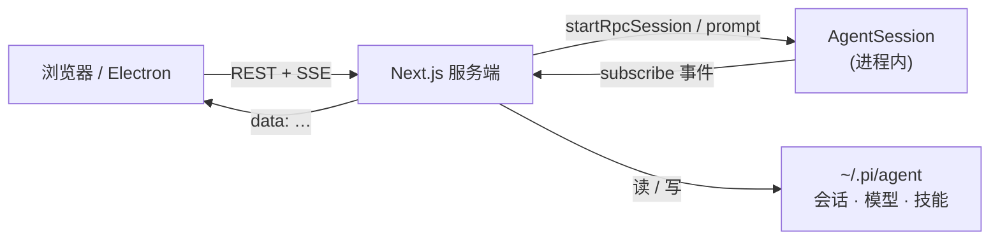

<div align="center">

# Pi Web

**[pi 编程智能体](https://github.com/badlogic/pi-mono) 的本地 Web UI 与桌面壳**

[](https://www.npmjs.com/package/@agegr/pi-web)
[](https://nodejs.org/)
[](./LICENSE)
[](https://nextjs.org/)

[English](./README.md) · [npm 包](https://www.npmjs.com/package/@agegr/pi-web) · [Worktree 说明](./docs/worktrees.zh-CN.md) · [Issues](https://github.com/agegr/pi-web/issues)

</div>

---

Pi Web 把本机 pi 会话变成完整工作区：实时对话、会话树、模型与技能配置、Git 审查、内置终端、文件预览 —— 浏览器或 Electron 桌面端均可。

> [!NOTE]
> 本仓库是**维护中的二开版本**：在上游 pi web 能力之上，增加了桌面打包、Git/终端工作区、中英文界面等增强。

## 目录

- [为什么用 Pi Web](#为什么用-pi-web)
- [快速开始](#快速开始)
- [命令行参数](#命令行参数)
- [桌面端](#桌面端)
- [功能一览](#功能一览)
- [架构关系](#架构关系)
- [HTTP 代理](#http-代理)
- [路径与注意点](#路径与注意点)
- [开发](#开发)
- [项目结构](#项目结构)
- [许可证](#许可证)

## 为什么用 Pi Web

| | 只用 CLI | **Pi Web** |
| :--- | :--- | :--- |
| 历史会话 | 翻终端 / 记路径 | 按**项目树**浏览 |
| 流式输出 | TUI 文本流 | 结构化 Markdown、tool call、minimap |
| 分支探索 | 手动折腾 | **Fork** 新会话或切换**会话内分支** |
| 看代码 | 来回切应用 | 对话旁 **Explorer + 预览** |
| Git | 另开 shell | **审查面板** + worktree 切换 |
| 终端 | 单独窗口 | 多标签**项目终端** |
| 配置 | 改配置文件 | 模型 / 鉴权 / 技能 / 权限都在 UI |

## 快速开始

> [!IMPORTANT]
> 需要 **Node.js 20+**，以及可用的 [pi](https://github.com/badlogic/pi-mono) 环境（默认 `~/.pi/agent`：会话、模型、鉴权等）。

### 一行启动

```bash
npx @agegr/pi-web@latest
```

### 全局安装

```bash
npm install -g @agegr/pi-web
pi-web
```

然后打开 **[http://localhost:30141](http://localhost:30141)** —— 服务就绪后 CLI 会尝试自动打开浏览器。

## 命令行参数

<details>
<summary><b>端口、绑定地址、环境变量</b></summary>

<br/>

```bash
pi-web --port 8080              # 自定义端口
pi-web --hostname 127.0.0.1     # 仅本机访问（推荐）
pi-web -p 8080 -H 127.0.0.1     # 组合使用
pi-web --no-open                # 不自动打开浏览器

PORT=8080 pi-web                # 也支持环境变量
PI_WEB_NO_OPEN=1 pi-web         # 后台服务 / 不自动打开
```

| 参数 / 环境变量 | 含义 | 默认 |
| --- | --- | --- |
| `-p` / `--port` / `PORT` | 监听端口 | `30141` |
| `-H` / `--hostname` / `HOSTNAME` | 绑定地址 | 全部网卡 |
| `--no-open` / `PI_WEB_NO_OPEN=1` | 跳过打开浏览器 | Ready 时打开 |
| `PI_CODING_AGENT_DIR` | 覆盖 pi agent 目录 | `~/.pi/agent` |

</details>

> [!WARNING]
> 应用**没有登录鉴权**。若主机对不可信网络可达，请使用 `--hostname 127.0.0.1`。Electron 桌面版默认只监听本机回环地址。

## 桌面端

作为原生应用运行（当前以 macOS DMG 为主要打包路径）。

```bash
npm install
npm run electron:dev      # 本地源码 + Electron
npm run electron:prod     # 生产 standalone → Electron
npm run dist:dmg          # 打包 macOS arm64 DMG
```

<details>
<summary><b>桌面端环境变量</b></summary>

<br/>

| 变量 | 作用 | 默认 |
| --- | --- | --- |
| `PI_WEB_ELECTRON_PORT` / `PI_WEB_PORT` | 优先使用的本地端口 | `30142` |
| `PI_WEB_NODE_BINARY` | 系统 Node 路径（供 `node-pty` 等） | 自动探测 |

</details>

## 功能一览

```text
┌──────────────┬─────────────────────┬──────────────────────┐
│  按项目会话  │  实时 Agent 对话    │  Git + 终端          │
│  树状浏览    │  SSE · 工具 · 花费  │  审查 · 多标签       │
├──────────────┼─────────────────────┼──────────────────────┤
│  Worktree    │  文件浏览与预览     │  模型 · Skills       │
│  切换 cwd    │  源码 · PDF · DOCX  │  OAuth · API key     │
├──────────────┼─────────────────────┼──────────────────────┤
│  Fork /      │  权限模式           │  中 EN · 主题        │
│  会话内分支  │  ask · full/YOLO    │  minimap · 提示音    │
└──────────────┴─────────────────────┴──────────────────────┘
```

- **会话工作区** — 重命名、删除、导出 HTML；不用再翻路径找历史
- **实时对话** — SSE 流、tool call/result、thinking、压缩与上下文占用
- **安全分支** — Fork 出新 `.jsonl`，或在同一会话内 Continue / 切换分支
- **Git Worktree** — 侧边栏切换 checkout，会话仍按项目聚合；见 [Worktree 说明](./docs/worktrees.zh-CN.md)
- **Git 审查** — 状态、diff、跳转打开文件，和对话并排
- **内置终端** — 多个项目 cwd 终端（xterm + node-pty）
- **文件浏览与预览** — 源码、Markdown、图片、音频、PDF、DOCX
- **模型与鉴权** — 编辑 `models.json`、OAuth / API key、连通性测试
- **Skills** — 按运行时加载方式列出、搜索、安装与开关
- **权限模式** — 输入栏切换 ask / full
- **中英文** — 应用内切换，偏好持久化
- **体验细节** — 明暗主题、聊天 minimap、完成提示音、快捷键（<kbd>Esc</kbd> 中止）

## 架构关系



| 场景 | 行为 |
| --- | --- |
| 会话列表 / 历史 | 通过 `SessionManager` 读 `.jsonl` —— **不**拉起 agent |
| 发送消息 | `startRpcSession()` 创建进程内 `AgentSession` |
| 实时更新 | `GET /api/agent/[id]/events` SSE |
| 运行中徽章 | `/api/agent/running/events` 驱动侧边栏状态 |

## HTTP 代理

服务端模型与 API 请求会读取 `HTTP_PROXY`、`HTTPS_PROXY`、`NO_PROXY`。

<details>
<summary><b>macOS / Linux</b></summary>

```bash
HTTP_PROXY=http://127.0.0.1:7890 \
HTTPS_PROXY=http://127.0.0.1:7890 \
NO_PROXY=localhost,127.0.0.1 \
npx @agegr/pi-web@latest
```

</details>

<details>
<summary><b>Windows PowerShell</b></summary>

```powershell
$env:HTTP_PROXY = "http://127.0.0.1:7890"
$env:HTTPS_PROXY = "http://127.0.0.1:7890"
$env:NO_PROXY = "localhost,127.0.0.1"
npx @agegr/pi-web@latest
```

</details>

## 路径与注意点

| 主题 | 说明 |
| --- | --- |
| 数据目录 | `~/.pi/agent` · 可用 `PI_CODING_AGENT_DIR` 覆盖 |
| 会话文件 | `~/.pi/agent/sessions/<编码后的 cwd>/<时间戳>_<uuid>.jsonl` |
| 模型配置 | Models 面板 ↔ agent 目录下的 `models.json` |
| 文件访问 | 限定在会话 cwd、项目根、`~/pi-cwd-*`、显式允许根 |
| Fork vs 分支 | **Fork** → 新 `.jsonl` · **Continue** → 同一文件内共享 `parentId` |
| 内置包 | permission、subagents、todo、ask-user、better-compaction 等启动时自动安装 |

> [!TIP]
> 会话头里的 `parentSession` 只是**展示元数据** —— 删除后级联改父节点时整文件重写是安全的。

## 开发

```bash
npm install
npm run dev    # → http://localhost:30141
```

```bash
node_modules/.bin/tsc --noEmit
npm run lint
```

| 脚本 | 作用 |
| --- | --- |
| `npm run dev` | Next.js 开发服务 · 端口 `30141` |
| `npm run build` | 生产构建 *（仅发布 / Electron）* |
| `npm run start` | 启动生产构建 |
| `npm run electron` / `electron:dev` | 启动桌面壳 |
| `npm run build:electron` | 构建并准备 Electron standalone |
| `npm run dist:dmg` | 打包 macOS DMG |
| `npm run release` | 递增 patch · 构建 · 发布 npm |

> [!CAUTION]
> **用 `npm run dev` 迭代时不要执行 `next build` / `npm run build`。** 构建会写入 `.next/`，容易干扰开发服务器；生产构建留给发布或 Electron 打包。

## 项目结构

<details>
<summary><b>展开目录地图</b></summary>

```text
app/api/
  agent/          # AgentSession + SSE
  auth/           # OAuth + API key
  cwd/            # 工作目录校验
  default-cwd/    # ~/pi-cwd-* 辅助
  file-index/     # 模糊文件索引
  files/          # 列表 · 读取 · 预览 · watch
  git/            # 审查面板 status + diff
  home/           # 用户 home
  models/         # 目录 · 默认 · thinking levels
  models-config/  # models.json + 测试
  permissions/    # ask / full 模式
  sessions/       # 列表 · 重命名 · 删除 · 上下文 · 导出
  skills/         # 列表 · 搜索 · 安装 · 开关
  worktrees/      # 列表 · 创建 · 删除

components/
  AppShell.tsx · SessionSidebar.tsx · ChatWindow.tsx · ChatInput.tsx
  MessageView.tsx · GitPanel.tsx · TerminalPanel.tsx
  ModelsConfig.tsx · SkillsConfig.tsx · FileExplorer.tsx · FileViewer.tsx

lib/
  rpc-manager.ts · session-reader.ts · pty-sessions.ts · worktree.ts
  permission-mode.ts · http-dispatcher.ts · file-access.ts
  i18n/ · ensure-builtin-packages.ts

hooks/
  useAgentSession.ts · useLocale.ts · useKeyboardShortcuts.ts
  useTheme.ts · useAudio.ts · useDragDrop.ts · useIsMobile.ts

electron/         # 桌面 main + preload
bin/pi-web.js     # npm CLI 入口
scripts/          # 打包 + node-pty 修复
instrumentation.ts
```

</details>

## 相关链接

- [Pi Web 里的 Worktree](./docs/worktrees.zh-CN.md)
- [English README](./README.md)
- 上游智能体：[badlogic/pi-mono](https://github.com/badlogic/pi-mono)

---

<div align="center">

**MIT** © [agegr](https://github.com/agegr) · 为 pi coding agent 打造

</div>
