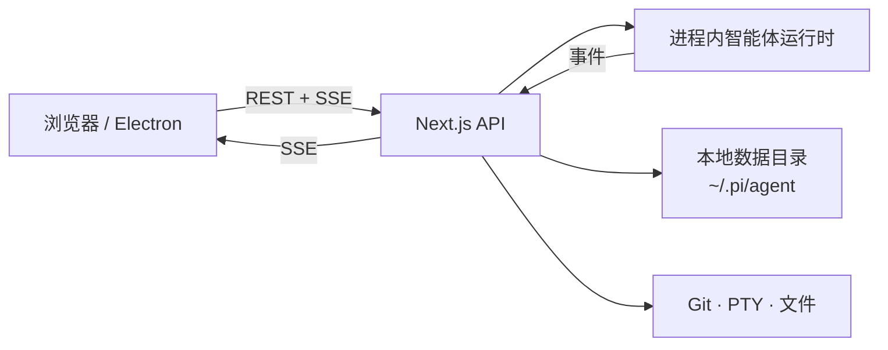

<div align="center">

# Pi Web

**本地智能体工作区 — 对话、文件、Git、终端一体化**

Web UI + Electron 桌面端 · [ct-jyjntc/pi-web](https://github.com/ct-jyjntc/pi-web)

[](https://nodejs.org/)
[](./LICENSE)
[](#桌面端)
[](https://github.com/ct-jyjntc/pi-web)

[English](./README.md)
·
[Issues](https://github.com/ct-jyjntc/pi-web/issues)
·
[Releases](https://github.com/ct-jyjntc/pi-web/releases)

<br/>

<table>
  <tr>
    <td width="50%">
      
      <p align="center"><sub>浅色</sub></p>
    </td>
    <td width="50%">
      
      <p align="center"><sub>深色</sub></p>
    </td>
  </tr>
</table>

</div>

---

Pi Web 是跑在你本机上的 **local-first 编程智能体工作区**。  
打开项目、和智能体对话、审查 Git 变更、浏览文件、开终端 —— 浏览器或桌面端均可。

| | |
| :--- | :--- |
| 仓库 | [github.com/ct-jyjntc/pi-web](https://github.com/ct-jyjntc/pi-web) |
| 默认地址 | `http://127.0.0.1:30141` |
| 桌面端口 | `30142`（Electron） |
| Node | **≥ 22.19.0** |
| 许可 | MIT |

## 能力一览

- **智能体对话** — 流式输出、工具调用 / 结果、thinking、上下文与花费、压缩
- **会话中心** — 按项目分组、重命名 / 删除 / 导出 HTML、自动标题、Fork 与会话内分支
- **Git 审查** — 状态、暂存 / 取消暂存、丢弃、提交、提交并推送、拉取、建分支、**AI 生成 commit message**
- **Worktree** — 侧边栏切换 / 创建 / 删除（[说明](./docs/worktrees.zh-CN.md)）
- **终端** — 多标签 PTY（xterm + node-pty），cwd 跟随项目
- **文件** — 资源管理器、模糊索引、源码 / Markdown / 图片 / 音频 / PDF / DOCX 预览
- **模型与鉴权** — 供应商、OAuth / API key、`models.json` 编辑、模型连通测试
- **Skills** — 列表、搜索、安装、更新、启停
- **权限** — 输入栏 ask / full
- **设置** — 主题、语言、工具模型（会话标题 + commit message）、检查更新
- **中英文与体验** — EN / 中文、明暗主题、聊天 minimap、快捷键、完成提示音
- **桌面端** — Electron + 原生窗口控件；macOS DMG、Windows NSIS

```text
┌────────────────┬─────────────────────┬──────────────────────┐
│  项目与会话    │  对话 + 工具        │  审查工作区          │
│                │  模型 · 权限        │  Git · 文件 · 终端   │
└────────────────┴─────────────────────┴──────────────────────┘
```

## 从源码运行

> 需要 Node.js **22.19.0+**。

```bash
git clone https://github.com/ct-jyjntc/pi-web.git
cd pi-web
npm install
npm run dev          # http://127.0.0.1:30141
```

生产 Web 服务：

```bash
npm run build
npm run start        # http://127.0.0.1:30141
```

| 脚本 | 绑定 |
| --- | --- |
| `npm run dev` / `start` | `127.0.0.1:30141` |
| `npm run dev:lan` / `start:lan` | `0.0.0.0:30141`（仅可信网络） |

### CLI 入口（构建后）

```bash
node bin/pi-web.js
node bin/pi-web.js --port 8080
node bin/pi-web.js --hostname 0.0.0.0
node bin/pi-web.js --no-open
```

| 参数 / 环境变量 | 含义 | 默认 |
| --- | --- | --- |
| `-p` / `--port` / `PORT` | HTTP 端口 | `30141` |
| `-H` / `--hostname` / `PI_WEB_HOSTNAME` | 绑定地址 | `127.0.0.1` |
| `--no-open` / `PI_WEB_NO_OPEN` | 不打开浏览器 | 关 |
| `PI_CODING_AGENT_DIR` | 本地智能体数据目录 | `~/.pi/agent` |

> [!WARNING]
> **没有登录**。绑定到非回环地址会暴露高权限智能体接口，只在可信网络使用。

### HTTP 代理

服务端模型请求遵循 `HTTP_PROXY`、`HTTPS_PROXY`、`NO_PROXY`。

```bash
HTTP_PROXY=http://127.0.0.1:7890 \
HTTPS_PROXY=http://127.0.0.1:7890 \
NO_PROXY=localhost,127.0.0.1 \
npm run start
```

## 桌面端

```bash
npm install
npm run electron:dev       # 开发 UI + Electron
npm run electron:prod      # 生产 standalone + 应用
npm run dist:dmg           # macOS arm64 DMG
npm run dist:mac           # DMG + zip
npm run dist:win           # Windows NSIS
```

| 环境变量 | 作用 | 默认 |
| --- | --- | --- |
| `PI_WEB_ELECTRON_PORT` / `PI_WEB_PORT` | 应用内本地端口 | `30142` |
| `PI_WEB_NODE_BINARY` | 原生模块用的系统 Node | 自动 |

`npm run build:electron` 会构建 Next standalone 并打包桌面运行时资源。

## 应用结构



| 模块 | 实现 |
| --- | --- |
| 会话 | `app/api/sessions/*` · `lib/session-reader.ts` |
| 实时智能体 | `app/api/agent/*` · `lib/rpc-manager.ts` |
| Git | `app/api/git/*` · `components/GitPanel.tsx` |
| 终端 | `app/api/cwd/pty/*` · `lib/pty-sessions.ts` · `TerminalPanel.tsx` |
| 文件 | `app/api/files/*` · `file-index` · `FileExplorer` / `FileViewer` |
| 模型 / 鉴权 | `app/api/models*` · `app/api/auth/*` · `ModelsConfig.tsx` |
| Skills | `app/api/skills/*` · `SkillsConfig.tsx` |
| 设置 | `app/api/web-settings` · `SettingsConfig.tsx` |
| Worktree | `app/api/worktrees` · `lib/worktree.ts` |
| 更新检查 | `app/api/app-update` |
| 国际化 | `lib/i18n/messages.ts` · `hooks/useLocale.ts` |

## 本地数据

| 路径 | 作用 |
| --- | --- |
| `~/.pi/agent` | 默认数据根目录（`PI_CODING_AGENT_DIR` 可覆盖） |
| `…/sessions/…/*.jsonl` | 会话历史 |
| `…/models.json` | 模型 / 供应商配置（也可在 UI 编辑） |
| 内置包 | 启动时为 Web/桌面自动安装 |

文件访问限定在会话 cwd、项目根、`~/pi-cwd-*` 以及显式允许的根目录。

## 开发脚本

| 脚本 | 作用 |
| --- | --- |
| `npm run dev` / `dev:lan` | Next 开发服务 |
| `npm run start` / `start:lan` | 生产服务 |
| `npm run build` | Next 生产构建 |
| `npm run build:electron` | Web 构建 + Electron standalone + 运行时打包 |
| `npm run electron*` | 桌面端流程 |
| `npm run dist:dmg` / `dist:mac` / `dist:win` | 安装包 |
| `npm run lint` | ESLint |
| `npm run verify` | 离线（+ 可选 HTTP）冒烟检查 |

```bash
npm run verify
VERIFY_HTTP=1 npm run verify   # 服务已启动时
```

> [!CAUTION]
> **`npm run dev` 运行时不要执行 `npm run build`。** 两者都会写 `.next/`，会互相踩。

<details>
<summary><b>源码目录</b></summary>

```text
app/api/           REST + SSE
components/        AppShell、对话、GitPanel、TerminalPanel、设置…
hooks/             会话 SSE、语言、快捷键、主题、音频
lib/               运行时、安全、git、pty、i18n、会话 IO
electron/          桌面 main + preload
bin/               CLI 入口
scripts/           打包、node-pty 权限、verify
docs/              worktree 说明 + 截图
```

</details>

## 文档

- [Worktree 说明](./docs/worktrees.zh-CN.md)
- [English README](./README.md)

---

<div align="center">

**MIT** · [ct-jyjntc/pi-web](https://github.com/ct-jyjntc/pi-web)

</div>
